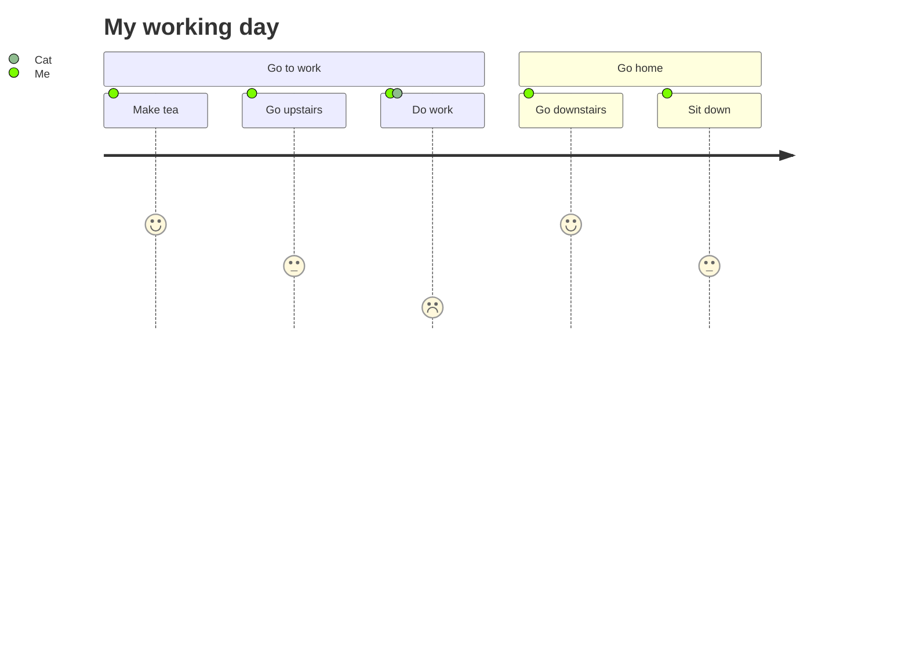
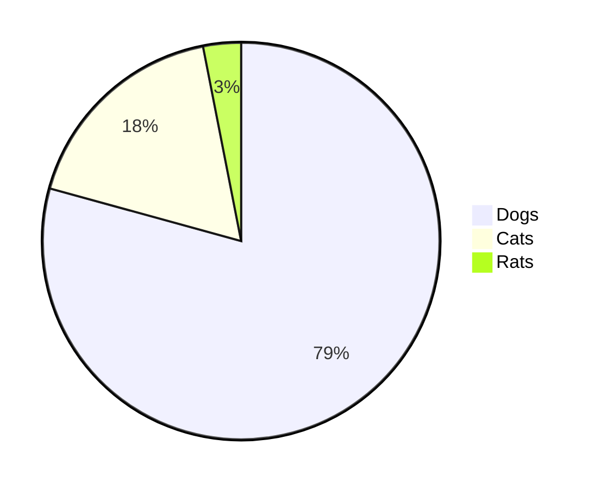
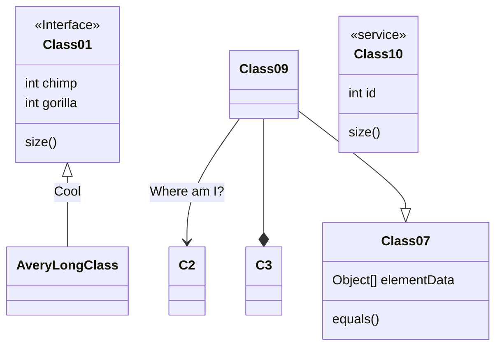
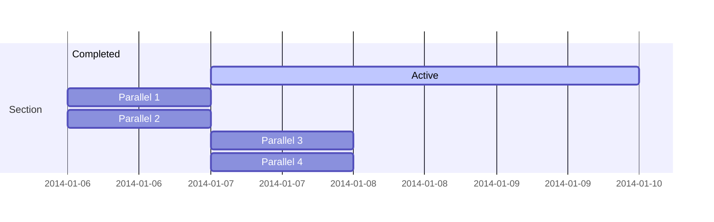
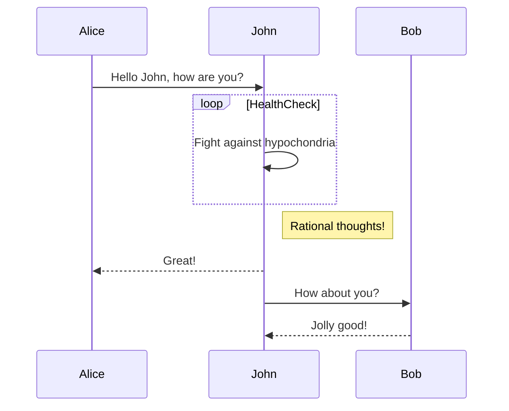
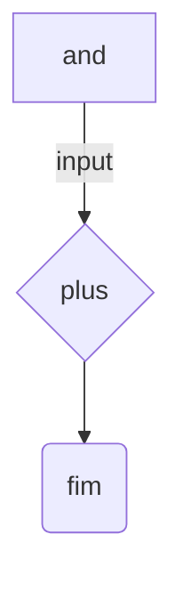
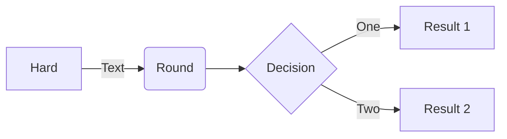
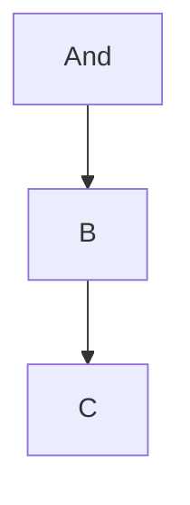

$\displaystyle \sum$

```mermaid
gantt
    title Git Issues - days since last update
    dateFormat  X
    axisFormat %s

    section Issue19062
    71   : 0, 71
    section Issue19401
    36   : 0, 36
    section Issue193
    34   : 0, 34
    section Issue7441
    9    : 0, 9
    section Issue1300
    5    : 0, 5
```


























```mermaid
info
```





<details>

<summary>Sumário for collapsed sections</summary>
## Header of collapsed section

```ruby
puts "hello"
```

| tavelkfdsjfl | tave |
| :--- | :--- |
| 12 | 34 |
  
</details>

